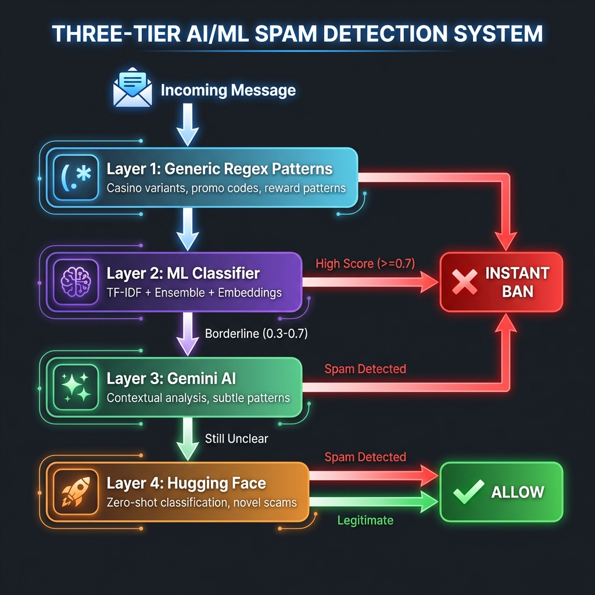

# Night Watchman 🌙🤖

**AI-Powered Telegram Superbot** — 24/7 intelligent watchdog with hybrid AI/ML spam detection. Protects your groups from spam, scams, recruitment fraud, and more using advanced Deep Learning + Ensemble ML classifiers.

**Latest Release:** v1.4.0 (January 13, 2026) - 🧠 Adaptive Scam Detection
- **NEW:** Generic pattern detection - catches ANY casino variant (42casino, 77casino, 88casino, etc.)
- **NEW:** /newscam command - teach bot about new scams in natural language
- **NEW:** Hugging Face zero-shot AI - detects completely novel scams
- **NEW:** Auto-retraining ML - learns immediately from admin feedback
- **NEW:** Four-tier detection architecture (Regex → ML → Gemini → HF)
- **NEW:** Pattern extraction engine - extracts keywords from scam descriptions using AI

## 🧠 Adaptive Scam Detection

Night Watchman now features a **truly adaptive** four-tier AI/ML detection system that learns from new threats and catches novel variations automatically.

### Detection Architecture



**How It Works:**

1. **Layer 1: Generic Regex** - Fast pattern matching catches known variants (42casino, 77casino, lucky2026, etc.)
2. **Layer 2: ML Classifier** - Ensemble model trained on spam examples (TF-IDF + 3 classifiers)
3. **Layer 3: Gemini AI** - Intelligent contextual analysis for subtle patterns
4. **Layer 4: Hugging Face** - Zero-shot classification for completely novel scams

### 🎓 Teaching the Bot - `/newscam` Command

Admins can now teach the bot about new scams in plain English:

```
Admin: /newscam They're promoting 88casino with code mega2026 for $1000 bonus

Bot: ✅ Learned new scam pattern!
     📝 Category: casino
     🔑 Keywords extracted: 88casino, mega2026, $1000, bonus
     🎯 Patterns: 2 regex patterns extracted
     🤖 ML Model: Retrained with this example
     💡 The bot will now detect similar scams automatically!
```

**What happens:**
- Gemini AI extracts keywords and patterns from your description
- Bot adds example to ML training data
- ML model retrains **immediately** (5-10 seconds)
- Bot automatically detects similar scams going forward

### 🎯 Generic Pattern Detection

The bot now catches **ANY variant** automatically:

| Pattern Type | Examples Detected |
|--------------|-------------------|
| **Casino variants** | 42casino, 77casino, 88casino, 99casino, casino42, newcasino77 |
| **Promo codes** | lucky2026, lucky2027, win2025, mega2024, promo2026 |
| **Reward scams** | "Congratulations! $100 received", "Won $250 instantly" |
| **Signup spam** | "Sign up here: https://88casino.com" |

**Before:** Only caught specific patterns like "52casino"  
**Now:** Catches ANY number+casino combination automatically!

**Previous Release:** v1.3.0 (January 10, 2026) - 🧠 Advanced AI Hybrid Engine
- **NEW:** Hybrid AI Engine (TF-IDF + Semantic Embeddings)
- **NEW:** "Brain" Upgrade - understands sentence meaning, not just keywords
- **NEW:** Character N-gram analysis - detects "leetspeak" obfuscation (e.g. `P.r.0.f.i.t`)
- **NEW:** Gradient Boosting Classifier - detects complex non-linear scam patterns
- **NEW:** Heuristic Meta-Features - Analyzes emoji density, caps ratio, link counts
- **NEW:** Automatic Fallback - Gracefully degrades if heavy AI libraries can't load

**Previous Release:** v1.2.0 (December 18, 2025) - 🤖 ML Superbot Upgrade
- **NEW:** Ensemble Machine Learning classifier (3 AI models working together)
- **NEW:** Naive Bayes + Logistic Regression + Random Forest voting
- **NEW:** Self-learning from admin actions - gets smarter over time
- **NEW:** Monthly community satisfaction polls with scammer tracking
- **IMPROVED:** Forex/trading scam detection with flexible pattern matching
- **IMPROVED:** Recruitment scam detection with weighted scoring system

**Previous Release:** v1.1.4 (December 11, 2025) - � Bug Fixes & Memory Management
- **NEW RULE:** Messages with hyperlinked text (text_link) + more than 2 emojis = instant ban
- Catches disguised spam links hidden behind pretty emoji-laden text
- Improved emoji detection pattern for better coverage

**Previous Release:** v1.1.2 (December 10, 2025) - 📤 Forwarded Spam Detection Fix
- **CRITICAL FIX:** Forwarded messages now analyzed for spam content before taking action
- Forwarded casino/bot spam now triggers instant ban (not just mute)
- Added new instant-ban keywords: "winning streak", "top prize", "telegram bonus", etc.

**Previous Release:** v1.1.1 (December 9, 2025) - 🛡️ Aggressive Anti-Spam Overhaul
- Fixed all 6 reported scammer detection failures
- Cyrillic character deobfuscation for porn spam
- Instant-ban system for zero-tolerance violations
- Forward violation tracking with escalating penalties
- Bot account blocking
- Cool sassy ban message templates

## Features

### 💡 Advanced Hybrid AI (v1.3.0)
- **Deep Semantic Analysis** - Uses `sentence-transformers` to detect spam by meaning/intent
- **Gradient Boosting** - XGBoost-style algorithm for complex pattern recognition
- **Anti-Obfuscation** - Character N-grams catch `P.r.0.f.i.t`, `1nv3stment`
- **Meta-Features** - Smart analysis of message structure (Caps, Emojis/$, Links)
- **Fault Tolerant** - Auto-fallback to lightweight models if server load is high

### 🤖 ML Spam Detection (Standard)
- **Ensemble Machine Learning** - 3 classifiers vote on each message
- **Naive Bayes** - Fast probabilistic text classification
- **Logistic Regression** - Linear pattern detection
- **Random Forest** - Non-linear scam variant capture
- **Self-learning** - Improves from admin bans automatically
- **TF-IDF vectorization** - Understands word importance and n-grams

### 🛡️ Core Protection
- **Real-time spam detection** using multiple signals
- **CAS integration** - checks users against Combot Anti-Spam database (1M+ groups)
- **Bad language detection** - automatically detects and warns about profanity
- **Scammer detection** - identifies suspicious accounts on join
- **Anti-raid protection** - detects coordinated attacks
- **Forward blocking** - prevents forwarded spam (VIPs exempt)
- **Auto-delete** spam/bad language messages
- **Warn/mute/ban** repeat offenders automatically

### 👥 User Management
- **New user verification** - checks for suspicious account patterns
- **New user restrictions** - blocks links/media from users < 24h in group
- **Username requirement** - mutes users without username, kicks after 24h
- **Welcome messages** - greets new members with rules
- **Rate limiting** - detects message floods
- **Duplicate detection** - catches repeated spam messages

### ⭐ Reputation System
- **Daily activity points** - +1 point per day active
- **Valid spam reports** - +10 points for helping moderate
- **Warning penalties** - -10 points per warning
- **Level progression**: Newcomer → Member → Trusted → VIP
- **VIP perks** - Can forward messages, bypass restrictions

### 🔧 Admin Tools
- **Admin commands** - `/warn`, `/ban`, `/mute`, `/stats`, `/unwarn`
- **Admin reports** - sends alerts to your chat
- **Statistics tracking** - monitor bot activity
- **Analytics** - detailed group analytics via DM

### 💬 User Commands
- `/guidelines` - Show community rules
- `/help` - List available commands
- `/admins` - Tag all admins for help
- `/report` - Report a message (reply to message)
- `/rep` - Check your reputation
- `/leaderboard` - Top 10 users by reputation

## 🚀 Recent Updates (v1.2.0)

### 🤖 ML Superbot Upgrade
Night Watchman now uses **Ensemble Machine Learning** for spam detection:

**3-Classifier Voting System:**
| Classifier | Strength |
|------------|----------|
| **Naive Bayes** | Fast probabilistic baseline, excellent for text |
| **Logistic Regression** | Clear linear decision boundaries |
| **Random Forest** | Catches complex non-linear patterns |

- Uses **soft voting** - averages probability scores from all 3 models
- More robust than any single classifier alone
- Reduced false positives on legitimate messages
- Better detection of new scam variants

**Self-Learning:**
- When admins ban spammers, the message is added to training data
- Model retrains automatically every 10 new samples
- Gets smarter the more you use it!

**New Scam Detection:**
- Forex/trading scam patterns with flexible regex
- Recruitment scam scoring system (telegram handles, DM requests, earnings claims)
- Monthly community polls showing scammer takedown stats

### 📊 Stats Command Update
`/stats` now shows ML classifier status:
```
🤖 ML Classifier: Active
🧠 Model: Ensemble (NB + LR + RF)
📚 Training: 45 spam, 30 ham
```

## Previous Updates (v1.1.4)
  - `message_authors` - capped at 5,000 entries
  - `enhanced_messages` - capped at 2,000 entries
  - `report_cooldowns` - expired entries removed
  - `media_timestamps` - entries older than 1 hour removed
  - `member_join_dates` - entries older than 7 days removed

### 🧪 Testing Improvements
- Restructured tests into `tests/` directory
- Added pytest-compatible test functions
- Run tests with: `python tests/test_spam_detection.py`

## Previous Updates (v1.1.3)

### � Hyperlink + Emoji Detection
**Problem:** Spammers were hiding malicious links behind pretty emoji-laden text.

**Fix:** Messages with hyperlinked text (text_link entity) + more than 2 emojis now trigger instant ban.

## Previous Updates (v1.1.2)

### 🎯 Fixed All 6 Scammer Detection Failures
1. **Cyrillic-obfuscated porn** - Deobfuscates Cyrillic lookalikes (х→x, р→p, о→o)
2. **Aggressive DM solicitation** - Detects "DM me now", "inbox me"
3. **Emoji-obfuscated links** - Flags excessive emojis + bot links
4. **Bot account joins** - Blocks accounts by is_bot flag + username patterns
5. **Casino/betting promo** - Instant bans on 1win, casino keywords
6. **Forwarded spam** - Mutes on first, bans on repeat

### 💥 Instant-Ban System
Zero-tolerance violations trigger immediate permanent ban:
- Adult/porn content (normalized for obfuscation)
- Telegram bot links (t.me/botname)
- DM solicitation phrases
- Casino & betting scams
- Excessive emoji spam combinations

### 🎭 Cool Ban Messages
Bot now responds with entertaining ban notifications across 8 categories with sassy responses.

## Detection Signals

| Signal | Description |
|--------|-------------|
| **Spam Keywords** | Detects scam phrases ("dm me for gains", "guaranteed profit") |
| **Bad Language** | Detects profanity and inappropriate words |
| **URLs** | Blocks suspicious links, URL shorteners |
| **New Users** | Restricts link posting for new members |
| **Suspicious Accounts** | Detects suspicious usernames, missing profiles |
| **Rate Limit** | Flags users sending too many messages |
| **Duplicates** | Detects repeated spam messages |
| **Formatting** | Catches excessive CAPS, emojis |
| **Crypto Addresses** | Flags wallet addresses (often scams) |
| **Raid Detection** | Detects multiple users joining quickly |

## Setup

1. Create a bot with @BotFather
2. Copy `.env.example` to `.env` and add your token
3. Add the bot to your group **as admin** with delete permissions

```bash
pip install -r requirements.txt
python3 night_watchman.py
```

## Environment Variables

| Variable | Description | Required |
|----------|-------------|----------|
| `TELEGRAM_BOT_TOKEN` | Bot token from @BotFather | ✅ Yes |
| `ADMIN_CHAT_ID` | Your chat ID for spam reports | ✅ Yes |
| `ADMIN_USER_IDS` | Comma-separated list of admin user IDs | ✅ Yes |
| `GEMINI_API_KEY` | Google Gemini API key (free tier) | ⚡ Recommended |
| `HUGGINGFACE_API_KEY` | Hugging Face API token (free tier) | ⚡ Recommended |

### Getting API Keys (FREE)

**Gemini API (already configured):**
- Free tier: 15-60 RPM
- Used for intelligent scam analysis

**Hugging Face API (NEW - for adaptive detection):**
1. Sign up at https://huggingface.co/join (free)
2. Go to https://huggingface.co/settings/tokens
3. Click "New token" → Name: `nightwatchman` → Role: `read`
4. Copy token and add to `.env`: `HUGGINGFACE_API_KEY=hf_xxxxx`
5. Restart bot

**Without HF API:** Bot still works with 3-tier detection (Regex + ML + Gemini)  
**With HF API:** Full 4-tier detection + zero-shot novel scam detection

## Commands

### User Commands (Private Chat)
| Command | Description |
|---------|-------------|
| `/start` | Welcome message |
| `/stats` | Show bot statistics |

### Admin Commands (In Group - Reply, @username, or User ID)
| Command | Description |
|---------|-------------|
| `/warn` | Warn a user (reply, `/warn @user`, or `/warn <id>`) |
| `/ban` | Ban a user permanently |
| `/mute` | Mute a user for 24 hours |
| `/unwarn` | Clear warnings for a user |
| `/enhance` | Award +15 reputation points (reply to message) |
| `/cas` | Check user against CAS anti-spam database |
| `/stats` | Show detailed bot statistics |
| `/newscam <description>` | **NEW:** Teach bot about new scams (admin only) |

### Analytics Commands (Admin Only - Private)
| Command | Description |
|---------|-------------|
| `/analytics` | Today's group analytics |
| `/analytics 7d` | Last 7 days summary |
| `/analytics 14d` | Last 14 days summary |
| `/analytics 30d` | Last 30 days summary |
| `/analytics week` | Same as 7d |
| `/analytics month` | Same as 30d |

> **Note:** Analytics commands can be used by any group admin (command is deleted, results sent via DM) or in private chat with the bot.

## Analytics Features

📊 **What's tracked:**
- 🆕 New Active Members (first-time message senders)
- 👤 Total Known Users (all users who ever messaged)
- 💬 Total messages per day
- 🚫 Spam blocked per day
- 🤬 Bad language detected
- ⚠️ Warnings issued
- 🔇 Users muted
- 🔨 Users banned
- 🚨 Raid alerts
- 👤 Active users per day
- ⏰ Peak activity hours

> **Note:** For groups with hidden member lists, Telegram doesn't send join/exit notifications. Instead, we track "New Active Members" - users who send their first message.

## Required Bot Permissions

The bot needs these admin permissions in the group:
- Delete messages
- Restrict members (for muting)
- Add members (to receive member join/leave events)

## Auto-Moderation Actions

### Spam Detection
| Spam Score | Action |
|------------|--------|
| ≥ 0.7 | Delete + Warn user |
| ≥ 0.5 | Delete only |
| ≥ 0.3 | Flag for review |
| < 0.3 | Allow |

### Warning System
- **3 warnings** → User is muted for 24 hours
- **5 warnings** → User is banned permanently

### Bad Language
- Configurable action: `warn`, `delete`, `delete_and_warn`, or `mute`
- Default: Warns user and deletes message

### New User Protection
- Links blocked for first 24 hours
- Suspicious accounts can be auto-banned or restricted
- Anti-raid protection activates if 10+ users join in 5 minutes
- Username required - users without username are muted

## Reputation System

### Earning Points
| Action | Points |
|--------|--------|
| Daily activity | +5 |
| Valid spam report | +10 |
| 7-day streak bonus | +5 |
| 30-day streak bonus | +10 |
| Admin enhancement (`/enhance`) | +15 |
| Warning received | -10 |
| Muted | -25 |
| Unmuted (false positive) | +15 |

### Levels (Display Only)
| Level | Points | Description |
|-------|--------|-------------|
| 🆕 Newcomer | 0-50 | New to the community |
| 🌟 Member | 51-200 | Active participant |
| ⭐ Trusted | 201-500 | Regular contributor |
| 💎 VIP | 501+ | Top community member |

> **Note:** Levels are for display/recognition only. All moderation rules apply equally to everyone except admins.

---

*Built with ❤️ by @DecentralizedJM | Powered by Mudrex*
